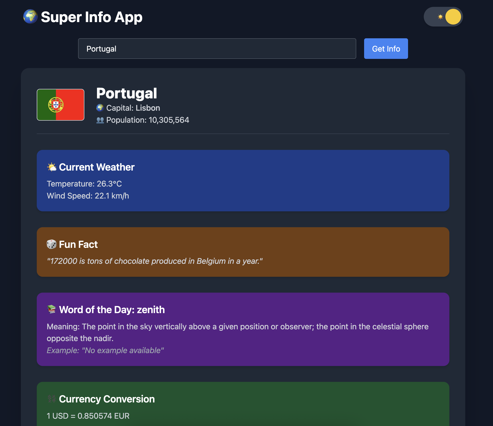

# 🌟 Super API

A high-performance React + Node.js application that combines multiple public APIs into a single, optimized service — delivering country information, weather data, fun facts, and more through a beautiful, accessible interface.

## 🚀 Features

✨ **Rich Country Information:**
- 🏳️ Country details (name, capital, population, flag) via REST Countries API
- 🌤️ Real-time weather data via Open-Meteo API
- 🎲 Random fun facts via Numbers API
- 🖼️ Dynamic imagery via Picsum Photos API
- 📚 Word of the day via Free Dictionary API
- 💱 Live currency conversion via ExchangeRate API



## 🛠️ Technical Features

### 🎯 Performance Optimizations
- ⚡ Client-side caching for API responses
- 🔄 Server-side caching with 5-minute TTL
- 📊 Parallel API requests for faster responses
- 🖼️ Lazy loading for images
- 🧠 React component memoization

### 🛡️ Reliability & Security
- 🔒 Rate limiting (30 requests/minute)
- 🌐 CORS protection
- ⏱️ Request timeout handling
- 📝 Input validation and sanitization
- 🔄 Exponential backoff for failed requests

### 👥 User Experience
- 🌓 Dark mode support with persistence
- ♿ Enhanced accessibility (ARIA labels)
- 🎨 Responsive design with Tailwind CSS
- ⚠️ Graceful error handling
- 📱 Mobile-friendly interface

## 🏗️ Tech Stack

- **Frontend:**
  - React
  - TailwindCSS
  - PropTypes for type checking
  - Lodash for utility functions

- **Backend:**
  - Node.js
  - Vercel Serverless Functions
  - Node-cache for server-side caching

- **Development:**
  - ESLint for code quality
  - Error Boundaries for fault tolerance
  - Responsive design patterns

## 🚀 Getting Started

1. **Clone the repository:**
   ```bash
   git clone <repository-url>
   ```

2. **Install dependencies:**
   ```bash
   # Install API dependencies
   cd api && npm install

   # Install frontend dependencies
   cd web && npm install
   ```

3. **Start the development server:**
   ```bash
   # Start the frontend
   cd web && npm start

   # In a separate terminal, start the API
   cd api && npm start
   ```

4. **Build for production:**
   ```bash
   cd web && npm run build
   ```

## 📁 Project Structure

```
super-api/
├── api/                 # Backend API
│   ├── super-info.js   # Main API handler
│   └── super-info-local.js
├── web/                 # Frontend React app
│   ├── src/
│   │   ├── App.jsx
│   │   ├── SuperInfoCard.jsx
│   │   └── index.js
│   └── public/
└── README.md
```

## 🔧 Configuration

The application includes several configurable parameters:

- **Rate Limiting:** 30 requests per minute per IP
- **Cache Duration:** 5 minutes TTL for API responses
- **Request Timeouts:** Configurable per external API
- **Retry Logic:** Exponential backoff with 3 retries

## 🌟 Optimizations

### Frontend
- Client-side caching reduces API calls
- Debounced search prevents API spam
- Lazy loading improves initial load time
- Dark mode preference persistence
- Memoized components prevent unnecessary re-renders

### Backend
- Server-side caching reduces external API calls
- Parallel API requests improve response times
- Rate limiting prevents abuse
- Structured error responses
- Memory cleanup for rate limiting data

## 🤝 Contributing

Contributions are welcome! Please feel free to submit a Pull Request.

## 📄 License

This project is licensed under the MIT License - see the LICENSE file for details.

---

## 🔗 Live Demo

Visit the live application at: [https://super-api-xhm7.vercel.app](https://super-api-xhm7.vercel.app/)